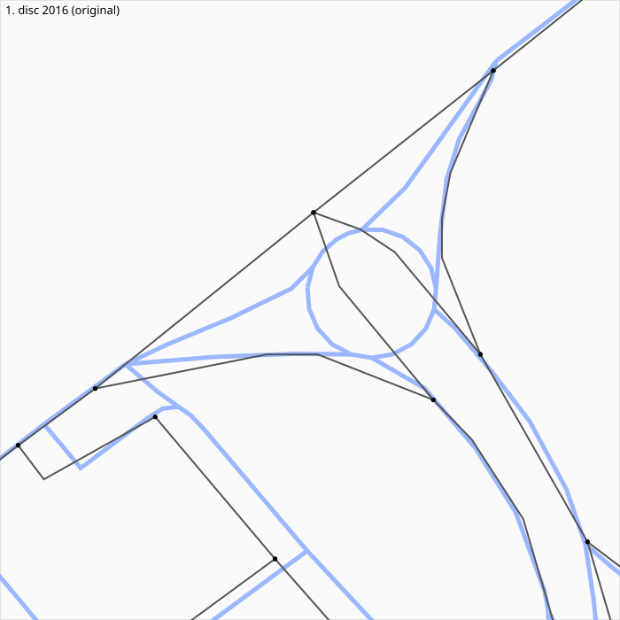
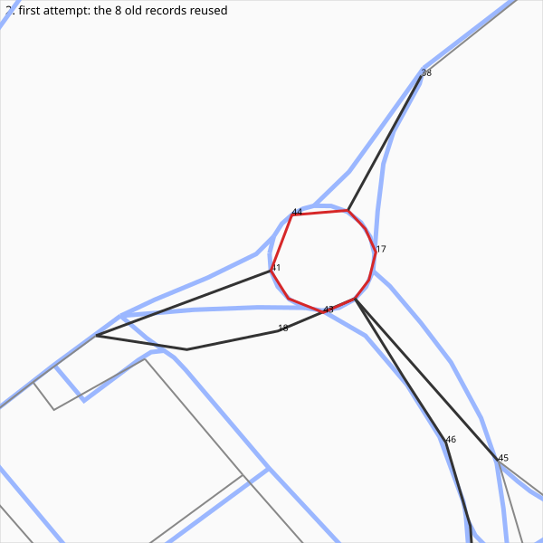
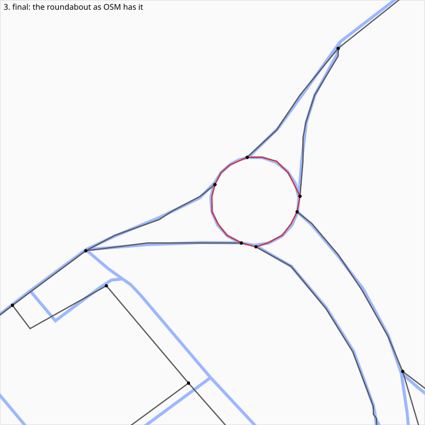

# 04 — Update a piece of the map from OSM: the Modugno roundabout

Test of the project's goal on a small area. Around 41°05'16.1"N 16°47'22.6"E (Modugno, Bari) a
roundabout was built after the 2016 data of DVD `NAV_DB_21708`; the disc still has a crossing
there. We compare the disc with today's OpenStreetMap, measure what would have to be updated, and
patch a **copy** of the disc.

Nothing here touches the original disc: all work is on `dataset/NAV_DB_21708_copy.ISO`, a
copy-on-write clone (`cp -c`, instant, no extra disk space). `dataset/` is git-ignored and holds
the copy and every intermediate table. Every change we make is logged in [`CHANGES.md`](CHANGES.md); what is open and how to test on a unit are in [`CHANGES.md`](CHANGES.md) and [`HARDWARE_TEST.md`](HARDWARE_TEST.md).

## Steps

| Script | Does | Writes (`dataset/`) |
|---|---|---|
| `01_extract_disc.py [--tag before\|after]` | street-level (`0x00`) tiles of the area, decoded; their segments | `disc_segments_<tag>.csv`, `tile_<BLOCK_ID>_<tag>.bin` |
| `02_fetch_osm.py` | OSM highways of the area (Overpass; kept on disk) | `osm_ways.json`, `osm_ways.csv` |
| `03_delta.py [--tag before\|after]` | disc vs OSM: present / removed (disc only) / new (OSM only); roundabouts by junction type | `delta_<tag>.csv` |
| `04_patch_tile.py [--write]` | first attempt, superseded: re-uses the 8 records of the crossing (3 ring nodes, straight arms), in place | `tile_0x4c184f18_patched.bin`, `before_after.svg`, `before.svg`, `after.svg` |
| `05_redraw_roundabout.py` | the roundabout as OSM has it, with the tile editor: 6 ring nodes and records, 4 links, Viale della Repubblica re-attached, old crossing removed; dry run | `tile_0x4c184f18_redrawn.bin`, `redraw.json` (old -> new offsets), `redraw_before.svg`, `redraw_after.svg` |
| `05b_redraw_coarse.py` | the same in the coarse tile `0x5c58a51c` (type `0x03`) | `tile_0x5c58a51c_redrawn.bin`, `redraw_coarse.json` |
| `06_patch_references.py [--fresh]` | writes both tiles into a fresh clone of the disc and rewrites everything that points into them (`0x0E`, `0x10`, `0x17`, `0x04`, neighbours' S6 twins) | `patched_blocks.json`, `patch_references.log` |
| `07_validate.py [--skip-diff]` | the validation battery: rules, image diff, twins, routing vs OSM, lookups | |

```bash
uv run python examples/04_update_modugno_roundabout/01_extract_disc.py
uv run python examples/04_update_modugno_roundabout/02_fetch_osm.py
uv run python examples/04_update_modugno_roundabout/03_delta.py --tol 15 --cover 0.7
# who points into the two tiles (whole-disc pass of the Rust tool, 40 s each, once):
carindb-rs/target/release/carindb-rs --iso dataset/NAV_DB_21708.ISO xref 0x4c184f18 > examples/04_update_modugno_roundabout/dataset/xref_4c184f18.txt
carindb-rs/target/release/carindb-rs --iso dataset/NAV_DB_21708.ISO xref 0x5c58a51c > examples/04_update_modugno_roundabout/dataset/xref_5c58a51c.txt
uv run --with numpy python examples/04_update_modugno_roundabout/05_redraw_roundabout.py        # dry run, reads the original
uv run --with numpy python examples/04_update_modugno_roundabout/05b_redraw_coarse.py
uv run --with numpy python examples/04_update_modugno_roundabout/06_patch_references.py --fresh  # writes the copy
uv run --with numpy python examples/04_update_modugno_roundabout/01_extract_disc.py --tag after
uv run python examples/04_update_modugno_roundabout/03_delta.py --tag after
uv run --with numpy python examples/04_update_modugno_roundabout/07_validate.py
# independent check of a written block with the Rust decoder (one block, no disc scan):
carindb-rs/target/release/carindb-rs --iso examples/04_update_modugno_roundabout/dataset/NAV_DB_21708_copy.ISO dump-block 4986959 --out /tmp/block.bin
```

To start over, run step 6 with `--fresh` (it re-clones the copy with `cp -c`). Steps 5 and 5b read the original image, not the copy.
Step 01 with `--tag before` must be run on a pristine copy (it reads the copy).

Each step takes seconds: the area is three tiles, and the delta is a flat-earth match of 8 m
samples (`common.py`). The Rust tools `dump-type` and `xref` are whole-disc passes and are not
needed here; `dump-block` (added for this test) decodes one block with the independent Rust decoder.

## Reading the result

- A disc segment is **present** if at least `--cover` of its samples lie within `--tol` metres of a
  drivable OSM way, otherwise **removed**; an OSM way is **present** if the same holds against the
  disc, otherwise **new**.
- Small features need a second test: a roundabout's arcs pass within the tolerance of the old crossing's
  arms, so coverage calls it present. `03_delta.py` therefore also checks each OSM roundabout way against the
  disc segments of junction type 6 (S4 `+0x11 & 0x0F`) within 6 m.
- Footways, paths, cycleways and the like are counted apart: the disc is a car map.
- Names are compared case-folded; the tolerance and cover are parameters, so the numbers depend on
  them (see `CHANGES.md` for the values used).

## Pictures

150 m square around the roundabout, north up. Light blue: OSM today. Grey and black: the disc's roads; black with a dot, the records of the crossing. Red (picture 2): ring records (junction type 6).

| 1. Disc 2016 (original) | 2. First attempt: 8 records reused | 3. Final: the roundabout as OSM has it |
|---|---|---|
|  |  |  |
